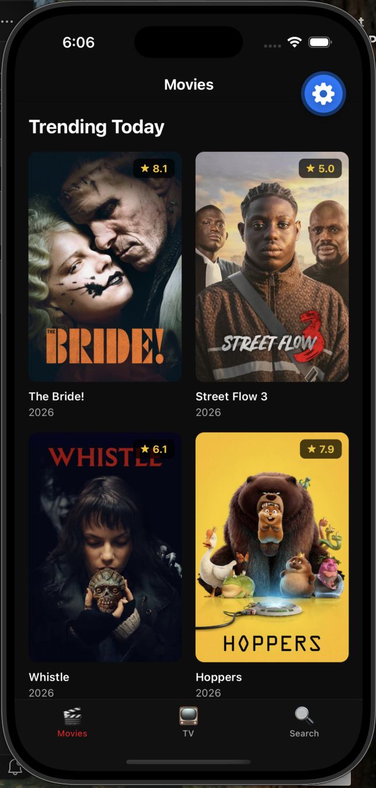
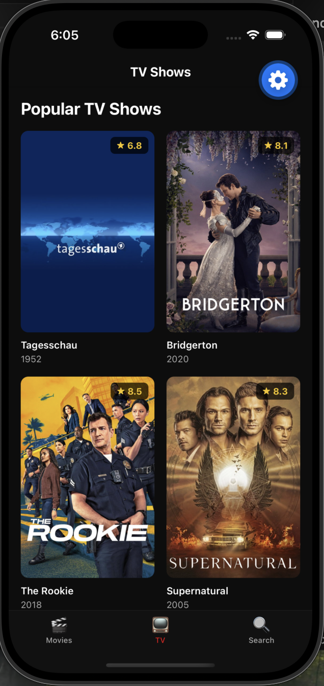
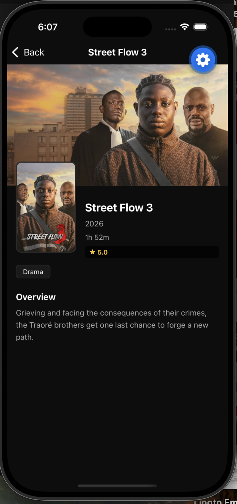
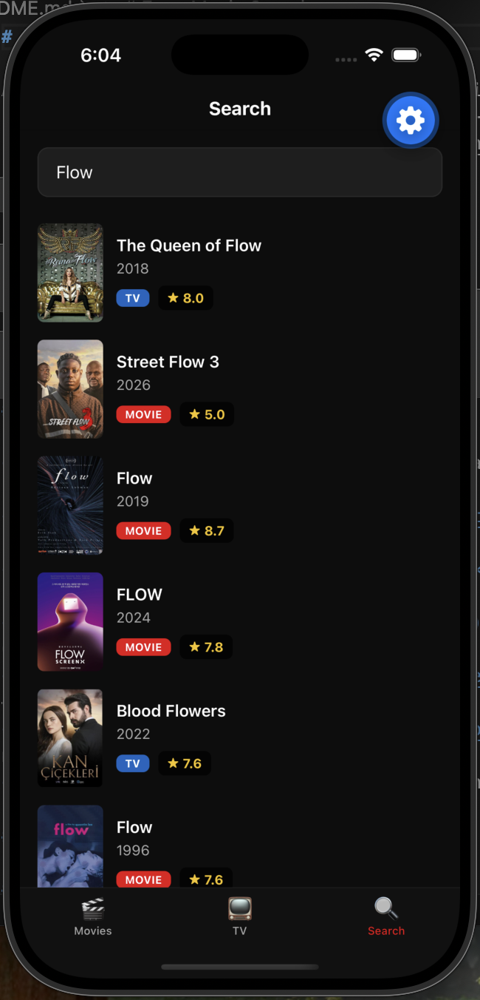

# Expo Movie Search

A React Native app built with Expo for browsing trending movies, popular TV shows, and searching across both — powered by the [TMDB API](https://www.themoviedb.org/documentation/api).

## Screenshots

| Movies | TV Shows | Detail | Search |
|--------|----------|--------|--------|
|  |  |  |  |

## Tech Stack

- **[Expo](https://expo.dev/)** (SDK 55) — managed workflow, build tooling
- **[Expo Router](https://expo.github.io/router/)** — file-based routing with tab and stack navigation
- **[React Native](https://reactnative.dev/)** 0.83 — core UI framework
- **[NativeWind](https://www.nativewind.dev/)** v4 — Tailwind CSS utility classes for React Native
- **[TanStack Query](https://tanstack.com/query)** (React Query) — server state management and caching
- **[TMDB API](https://developer.themoviedb.org/docs)** v3 — movie and TV data
- **TypeScript** — strict type safety throughout
- **[Jest](https://jestjs.io/)** + **[React Native Testing Library](https://callstack.github.io/react-native-testing-library/)** — unit and integration testing
- **[MSW](https://mswjs.io/)** (Mock Service Worker) v2 — API mocking for tests

## Getting Started

### Prerequisites

- Node.js and pnpm installed
- A free [TMDB API key](https://www.themoviedb.org/settings/api)

### Setup

```bash
# Install dependencies
pnpm install

# Add your TMDB API key
echo "EXPO_PUBLIC_TMDB_API_KEY=your_key_here" > .env

# Start the development server
pnpm start
```

## Features

- Browse trending movies and popular TV shows in a 2-column grid
- Tap any card to view full details — backdrop, poster, overview, genres, and rating
- Search across movies and TV shows simultaneously with 350ms debounce
- Infinite scroll with pagination on all list screens
